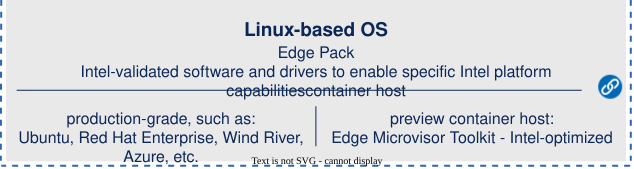

# Welcome to the Open Edge Platform GitHub Organization! 

Open Edge Platform is an Intel®-optimized open software platform for developing and testing scalable edge solutions. 

It offers a modular, composable software stack that brings together the open source ecosystem to help you design and build performant edge solutions that operate with cloud-like capabilities.

  

  

  

## The platform comprises five key repositories: 

* [Edge AI Suites](https://github.com/open-edge-platform/edge-ai-suites) - curated collections of sample applications designed as reference solutions to help you develop optimized AI products tailored to specific use cases. Suites incorporate a variety of shared Open Edge Platform components, as well as their own and third-party building blocks. Currently, seven suites are featured:

  * [Metro](https://github.com/open-edge-platform/edge-ai-suites/blob/main/metro-ai-suite)
  * [Manufacturing](https://github.com/open-edge-platform/edge-ai-suites/blob/main/manufacturing-ai-suite)
  * [Retail](https://github.com/open-edge-platform/edge-ai-suites/blob/main/retail-ai-suite)
  * [Robotics](https://github.com/open-edge-platform/edge-ai-suites/blob/main/robotics-ai-suite)
  * [Education](https://github.com/open-edge-platform/edge-ai-suites/blob/main/education-ai-suite)
  * [Health and Life Sciences](https://github.com/open-edge-platform/edge-ai-suites/tree/main/health-and-life-sciences-ai-suite)
  * [Federal and Aerospace](https://github.com/open-edge-platform/edge-ai-suites/tree/main/federal-and-aerospace-ai-suite)
    
* [Edge AI Libraries](https://github.com/open-edge-platform/edge-ai-libraries) provide edge-optimized, composable libraries, SDKs, and microservices
  to support the development of performant, production-grade multimodal edge AI applications, along with user-friendly workflows for optimization and
  deployment.
* [Image Composer Tool](https://github.com/open-edge-platform/image-composer-tool) is a framework that provides a general-purpose toolchain for composing
  OS images from pre-built artifacts of any Linux distribution that supports Debian or RPM packages. With Image Composer Tool, you can generate
  edge-optimized OS images using Intel's pre-curated YAML templates or your own customization. 
* [Edge Microvisor Toolkit](https://github.com/open-edge-platform/edge-microvisor-toolkit) is an edge-optimized container host offering the latest
  Intel silicon capabilities, for exploring advanced AI workloads at the edge. It is a minimal-footprint system based on Azure Linux distribution, sharing
  its open source license.
* [Edge Workloads and Benchmarks](https://github.com/open-edge-platform/edge-workloads-and-benchmarks) are performance-optimized pipelines that
  leverage the OpenVINO™ toolkit, the GStreamer multimedia framework,
* [Edge AI Libraries](https://github.com/open-edge-platform/edge-ai-libraries) provide
  edge-optimized libraries, tools, SDKs, and microservices to support you in developing
  performant edge AI applications, along with user-friendly workflows for optimization
  and deployment.
* [Image Composer Tool](https://github.com/open-edge-platform/image-composer-tool) 
  is a framework providing a general-purpose toolchain for composing OS images from
  pre-built artifacts of any Linux distribution that supports Debian or RPM packages.
  You can generate edge-optimized OS images using Intel's pre-set YAML templates or your
  own customizations. 
* [Edge Microvisor Toolkit](https://github.com/open-edge-platform/edge-microvisor-toolkit) 
  is an edge-optimized container host offering the latest Intel silicon capabilities,
  for exploring advanced AI workloads at the edge. It is a minimal-footprint system
  based on the Azure Linux distribution, sharing its open source license.
* [Edge Workloads and Benchmarks](https://github.com/open-edge-platform/edge-workloads-and-benchmarks) 
  are performance-optimized pipelines that leverage the OpenVINO™ toolkit, the GStreamer
  multimedia framework, and Deep Learning Streamer (DL Streamer) for validating media
  and edge AI analytics.

Each repository includes contribution guidelines and templates for reporting issues.

You can access the platform documentation at the [OEP Documentation Website](https://docs.openedgeplatform.intel.com/) to learn more about all the components, and use the [documentation AI assistant](https://docs.openedgeplatform.intel.com/2026.1/index.html?chat) to ask questions regarding the software.

Unless otherwise noted, the platform’s repositories are primarily released under the Apache 2.0 license.

Join our community and help shape the future of the edge!
